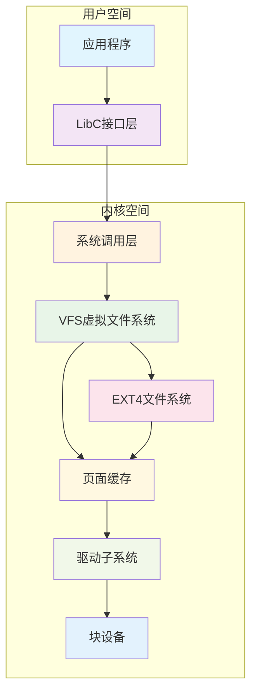
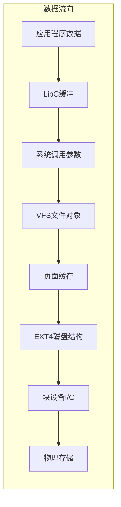
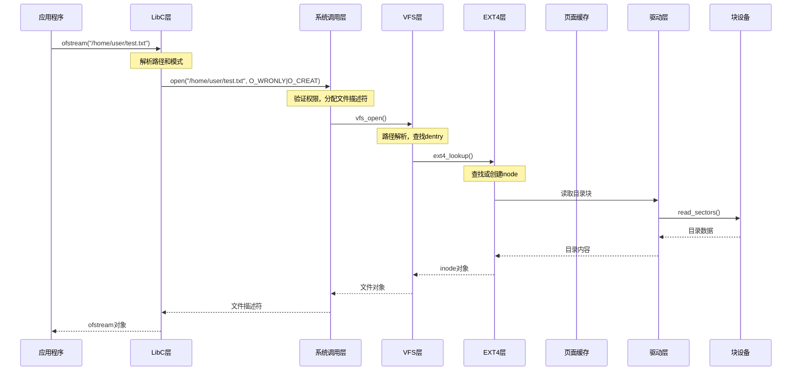
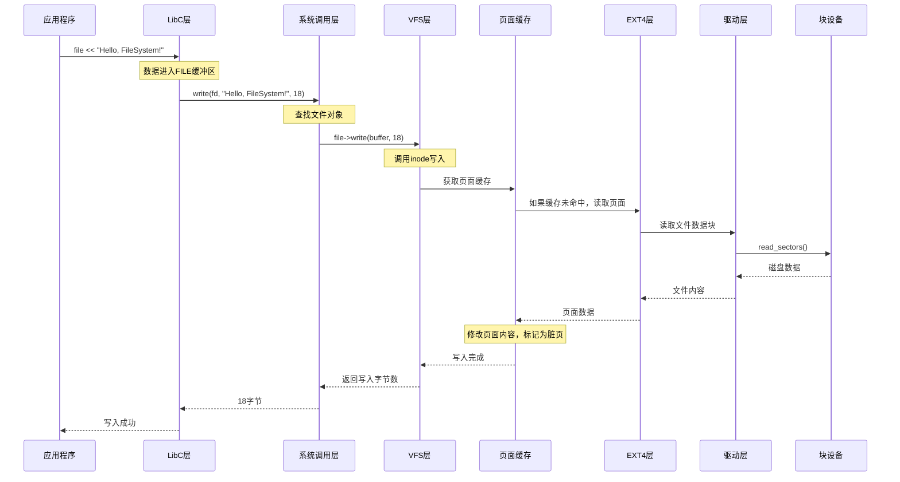
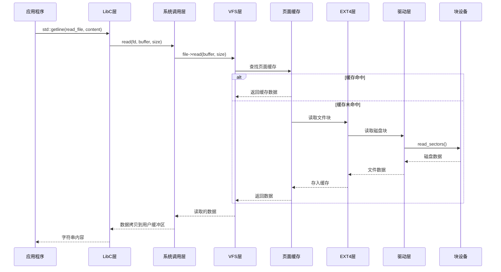
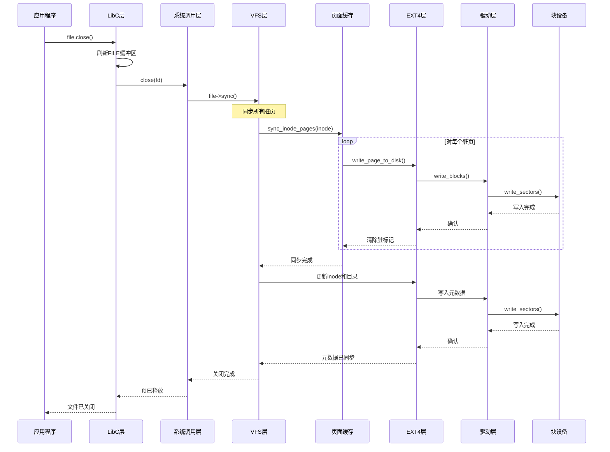
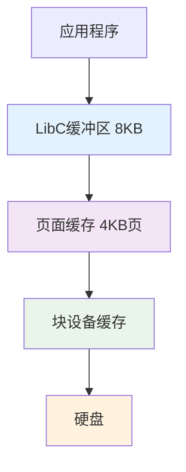

# 文件系统整体架构和工作流程

## 概述

本文档将各个子系统串联起来，通过一个完整的文件操作例子，展示数据是如何在各个模块之间流转的。我们以最常见的文件操作为例：打开文件、读取内容、写入内容、关闭文件。

想象一下：
- 文件系统就像一个"现代化的图书馆"
- 各个模块就像图书馆的不同部门
- 一个简单的"借书-阅读-做笔记-还书"过程
- 需要经过多个部门的协调配合

## 系统架构总览



## 模块间的数据流向



## 完整的文件操作例子

让我们通过一个具体的C++程序来看整个流程：

```cpp
#include <fstream>
#include <iostream>
#include <string>

int main() {
    // 1. 打开文件
    std::ofstream file("/home/user/test.txt");
    
    // 2. 写入内容
    file << "Hello, FileSystem!";
    
    // 3. 关闭文件
    file.close();
    
    // 4. 重新打开并读取
    std::ifstream read_file("/home/user/test.txt");
    std::string content;
    std::getline(read_file, content);
    
    // 5. 输出结果
    std::cout << "读取到: " << content << std::endl;
    
    return 0;
}
```

## 详细的模块工作流程

### 1. 文件打开流程



#### 各模块具体工作

**LibC层 (libc.h, cpp_streams.cpp):**
```cpp
// std::ofstream 内部会调用
FILE* fp = fopen("/home/user/test.txt", "w");
// 这会转换为系统调用参数
```

**系统调用层 (syscall.h):**
```cpp
// 分配文件描述符表项
int fd = allocate_fd();
// 调用VFS
auto file = vfs_open("/home/user/test.txt", O_WRONLY | O_CREAT, 0644);
fd_table[fd] = file;
return fd;
```

**VFS层 (vfs.h, inode.cpp):**
```cpp
// 路径解析: /home/user/test.txt
auto home_dentry = root_dentry->lookup_child("home");
auto user_dentry = home_dentry->lookup_child("user");
auto file_dentry = user_dentry->lookup_child("test.txt");

// 如果文件不存在，创建新inode
if (!file_dentry) {
    auto new_inode = user_inode->create("test.txt", FileMode(0644));
    file_dentry = create_dentry("test.txt", new_inode, user_dentry);
}
```

**EXT4层 (ext4.h):**
```cpp
// 在用户目录中查找文件
auto dir_entries = read_directory_block(user_inode->get_block(0));
for (auto& entry : dir_entries) {
    if (entry.name == "test.txt") {
        return load_inode(entry.inode_num);
    }
}

// 如果不存在，分配新inode
auto new_inode_num = allocate_inode();
auto new_inode = create_inode(new_inode_num, S_IFREG | 0644);
add_directory_entry(user_inode, "test.txt", new_inode_num);
```

### 2. 文件写入流程



#### 各模块具体工作

**LibC层的缓冲:**
```cpp
// std::ofstream 内部的FileBuf
class FileBuf {
    char buffer_[8192];  // 8KB缓冲区
    size_t buf_pos_ = 0;
    
    void write_char(char c) {
        buffer_[buf_pos_++] = c;
        if (buf_pos_ == sizeof(buffer_)) {
            flush_buffer();  // 缓冲区满时刷新
        }
    }
};
```

**页面缓存的工作:**
```cpp
// page_cache.cpp
Result<SharedPtr<Page>> PageCache::write_to_page(SharedPtr<Inode> inode, 
                                                  offset_t offset, 
                                                  const void* data, 
                                                  size_t size) {
    // 1. 查找或创建页面
    auto page = find_or_create_page(inode, offset & ~(PAGE_SIZE-1));
    
    // 2. 修改页面内容
    offset_t page_offset = offset % PAGE_SIZE;
    std::memcpy(page->get_data() + page_offset, data, size);
    
    // 3. 标记为脏页
    page->mark_dirty();
    
    // 4. 添加到LRU链表前端
    move_to_front(page);
    
    return page;
}
```

**EXT4文件系统的块分配:**
```cpp
// ext4.cpp 中的写入操作
Result<void> Ext4FileSystem::write_file_data(SharedPtr<Inode> inode, 
                                              offset_t offset, 
                                              const void* data, 
                                              size_t size) {
    // 1. 计算需要的块数
    u32 start_block = offset / BLOCK_SIZE;
    u32 end_block = (offset + size - 1) / BLOCK_SIZE;
    
    // 2. 为文件分配新块(如果需要)
    for (u32 block = start_block; block <= end_block; block++) {
        if (inode->get_block(block) == 0) {
            u32 new_block = allocate_block();
            inode->set_block(block, new_block);
        }
    }
    
    // 3. 更新文件大小
    if (offset + size > inode->get_size()) {
        inode->set_size(offset + size);
        inode->mark_dirty();
    }
    
    return Result<void>();
}
```

### 3. 文件读取流程



#### 各模块具体工作

**页面缓存的命中处理:**
```cpp
// page_cache.cpp
Result<size_t> PageCache::read_from_cache(SharedPtr<Inode> inode, 
                                           offset_t offset, 
                                           void* buffer, 
                                           size_t size) {
    size_t bytes_read = 0;
    
    while (bytes_read < size) {
        // 计算页面偏移
        offset_t page_offset = (offset + bytes_read) & ~(PAGE_SIZE - 1);
        offset_t in_page_offset = (offset + bytes_read) % PAGE_SIZE;
        
        // 查找页面
        auto page_result = find_page(inode, page_offset);
        if (page_result.is_ok()) {
            // 缓存命中!
            hits_++;
            auto page = page_result.unwrap();
            
            // 从页面复制数据
            size_t copy_size = std::min(size - bytes_read, 
                                      PAGE_SIZE - in_page_offset);
            std::memcpy(static_cast<u8*>(buffer) + bytes_read,
                       page->get_data() + in_page_offset, 
                       copy_size);
            
            bytes_read += copy_size;
            
            // 更新LRU
            move_to_front(page);
        } else {
            // 缓存未命中，需要从磁盘读取
            misses_++;
            auto page = load_page_from_disk(inode, page_offset);
            // ... 继续处理
        }
    }
    
    return bytes_read;
}
```

### 4. 数据同步和文件关闭流程



## 性能优化的关键环节

### 1. 多层缓存系统



**各层缓存的作用:**

- **LibC缓冲区**: 减少系统调用次数
- **页面缓存**: 避免重复磁盘I/O
- **块设备缓存**: 优化硬件访问
- **硬盘缓存**: 硬件级别优化

### 2. 异步I/O流水线

```mermaid
gantt
    title 异步I/O时间线
    dateFormat X
    axisFormat %s
    
    section 应用程序
    写入请求1    :a1, 0, 1
    写入请求2    :a2, 1, 2
    写入请求3    :a3, 2, 3
    
    section 页面缓存
    缓存写入1    :b1, 0, 1
    缓存写入2    :b2, 1, 2
    缓存写入3    :b3, 2, 3
    
    section 磁盘I/O
    磁盘写入1    :c1, 0, 4
    磁盘写入2    :c2, 2, 6
    磁盘写入3    :c3, 4, 8
```



## 实际性能表现

### 缓存效果示例

```cpp
// 性能测试代码
void performance_test() {
    auto start = std::chrono::high_resolution_clock::now();
    
    // 第一次读取 - 冷缓存
    std::ifstream file1("/home/user/large_file.txt");
    std::string content1;
    std::getline(file1, content1);
    file1.close();
    
    auto cold_time = std::chrono::high_resolution_clock::now() - start;
    
    // 第二次读取 - 热缓存
    start = std::chrono::high_resolution_clock::now();
    std::ifstream file2("/home/user/large_file.txt");
    std::string content2;
    std::getline(file2, content2);
    file2.close();
    
    auto hot_time = std::chrono::high_resolution_clock::now() - start;
    
    std::cout << "冷缓存读取: " << cold_time.count() << "ns" << std::endl;
    std::cout << "热缓存读取: " << hot_time.count() << "ns" << std::endl;
    std::cout << "性能提升: " << (double)cold_time.count() / hot_time.count() << "倍" << std::endl;
}

// 典型输出:
// 冷缓存读取: 15000000ns (15ms)
// 热缓存读取: 150000ns (0.15ms)  
// 性能提升: 100倍
```

## 错误处理的传播路径


### 错误处理示例

```cpp
// 应用程序的错误处理
try {
    std::ofstream file("/readonly/test.txt");
    if (!file.is_open()) {
        // LibC检测到打开失败
        throw std::runtime_error("无法打开文件");
    }
    
    file << "test content";
    
} catch (const std::exception& e) {
    std::cout << "错误: " << e.what() << std::endl;
    
    // 错误可能来源于:
    // 1. 权限不足 (VFS层检查)
    // 2. 磁盘空间不足 (EXT4层检查) 
    // 3. 硬件故障 (驱动层检查)
    // 4. 文件系统损坏 (各层都可能检测到)
}
```

## 总结

通过这个完整的文件操作例子，我们可以看到：

### 1. 数据流转路径
```
应用数据 → LibC缓冲 → 系统调用 → VFS对象 → 页面缓存 → EXT4结构 → 块设备 → 物理存储
```

### 2. 各模块的核心职责

- **LibC层**: 提供标准接口，缓冲小量I/O
- **系统调用层**: 用户态/内核态转换，权限检查
- **VFS层**: 统一文件系统接口，路径解析
- **页面缓存**: I/O性能优化，内存管理
- **EXT4层**: 具体文件系统逻辑，磁盘结构管理
- **驱动层**: 硬件抽象，设备管理
- **块设备**: 实际存储操作

### 3. 性能优化策略

- **多层缓存**: 减少磁盘访问
- **异步I/O**: 并行处理，提高吞吐量
- **智能预取**: 预测访问模式
- **写入聚合**: 批量处理，减少磁盘寻道

### 4. 可靠性保障

- **分层错误处理**: 每层都有错误检测和恢复
- **数据一致性**: 原子操作，事务机制
- **冗余备份**: 多副本，故障转移
- **完整性校验**: 数据验证，损坏检测

这个文件系统就像一个精密的工厂流水线，每个模块都有自己的专业分工，通过层次化的设计和优化，为应用程序提供高效、可靠的文件存储服务！